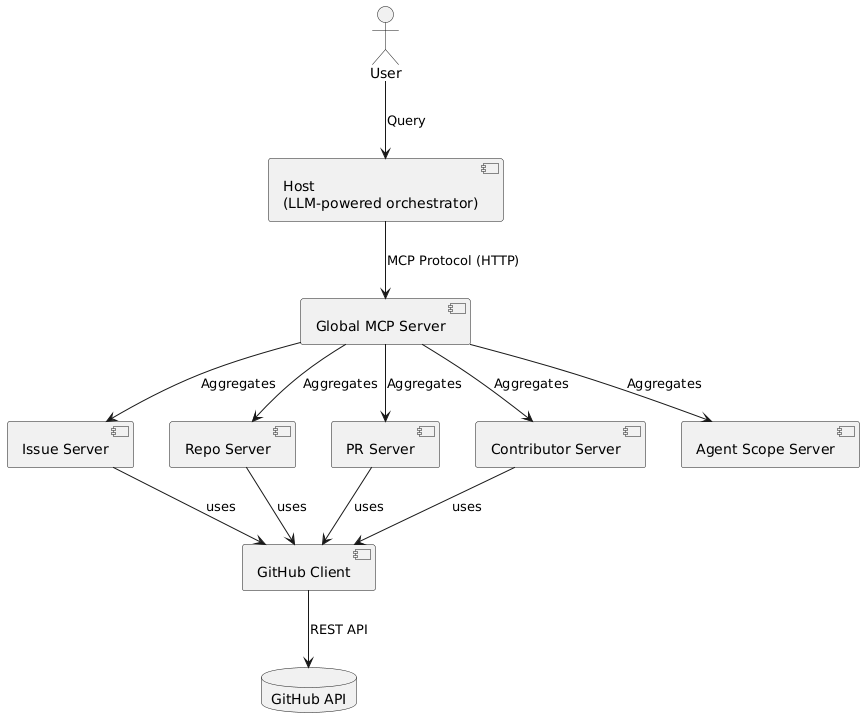

# Project Overview

This project is a GitHub Analytics system built to demonstrate how to design a clean, modular MCP (Model Context Protocol) architecture. The main focus isn’t on building the best analytics tool, but on applying separation of concerns: the "host" is responsible for user interaction and orchestration, while the "servers" handle all GitHub-specific logic and data retrieval. This clear architectural boundary makes the system easier to maintain, extend, and test.

# Architecture


The system is built around a clear separation of concerns between the host and the servers. The host, which contains an LLM as its "brain," acts as the orchestrator: it receives user queries, decides which tools to use, and communicates only with the global MCP server. The global MCP server aggregates the underlying servers (issue, repo, PR, contributor, etc.) that together provide the 19 tools and the system prompt. This means the host never needs to know about the individual servers or their internal details but just the global interface. Each underlying server is responsible for a specific domain (like issues, pull requests, or contributors) and handles all the logic and data fetching for that area.

Additionally, the servers do not interact with the GitHub API directly. Instead, all GitHub API requests are handled through a shared GitHub client module, which acts as an abstraction layer. This design makes it easier to maintain and test the code, and allows for swapping out the data source or mocking API calls if needed.

## Architecture Diagram




# How It Works 

1. **User Input:** The user types a question in the CLI (for example, "How many stars does facebook/react have?").
2. **Host Orchestration:** The host receives the question. It loads the system prompt and the list of available tools from the global MCP server.
3. **LLM Reasoning:** The host sends the user query, system prompt, and tool definitions to the LLM (Groq). The LLM decides which tool(s) to call and with what arguments.
4. **Tool Call Dispatch:** The host sends the tool call request to the global MCP server.
5. **Server Routing:** The global MCP server routes the request to the correct underlying server (issue, repo, PR, contributor, or agent scope), based on the tool prefix.
6. **GitHub Client Abstraction:** The server does not call the GitHub API directly. Instead, it uses a shared GitHub client module, which handles all HTTP requests to the GitHub API and abstracts away authentication, error handling, and pagination.
7. **Data Fetching:** The GitHub client fetches the required data from the GitHub API and returns it to the server, which processes and formats the result.
8. **Result Propagation:** The result flows back through the global MCP server to the host.
9. **LLM Finalization:** The host gives the result to the LLM, which may decide to call more tools or return a final answer to the user.
10. **User Output:** The answer is printed in the CLI.

This agentic loop continues (up to a max number of iterations) until the LLM is satisfied with the answer or reaches its step limit.

# Project Structure

```

├── github-analytics-mcp-servers/   # MCP servers (all analytics logic)
│   ├
│   ├── src/
│   │   ├── main.py                 # Server entry point
│   │   ├── config.py               # Server config
│   │   ├── clients/
│   │   │   └── github_client.py    # GitHub API abstraction
│   │   ├── servers/
│   │   │   ├── tool_registry.py    # Aggregates all servers
│   │   │   ├── repo_stats_server.py
│   │   │   ├── issue_server.py
│   │   │   ├── pr_analytics_server.py
│   │   │   ├── contributor_server.py
│   │   │   ├── agent_scope_server.py
│   │   │   └── prompts.py
│   │   └── utils/
│   │       └── opik_utils.py
│   └── tests/
│       └── test_all_servers_api.py
├── github-analytics-mcp-host/      # MCP host (LLM orchestrator)
│   ├── pyproject.toml
│   ├── src/
│   │   ├── main.py                 # CLI entry point
│   │   ├── config.py               # Host config
│   │   ├── host/
│   │   │   ├── host.py             # Host logic (agentic loop)
│   │   │   └── connection_manager.py
│   │   └── utils/
│   │       └── opik_utils.py
```

# Setup & Installation

**Requirements:**
- Python 3.10+
- GitHub personal access token
- Groq API key (for LLM)
- Opik API key (optional, for observability)

**Installation Steps:**

1. Clone the repository:
   ```bash
   git clone <your-repo-url>
   ```
2. Install server dependencies:
   ```bash
   cd github-analytics-mcp-servers
   pip install -e .
   ```
3. Install host dependencies:
   ```bash
   cd ../github-analytics-mcp-host
   pip install -e .
   ```
4. Set up environment variables:
   - In `github-analytics-mcp-servers/.env`:
     ```env
     GITHUB_TOKEN=your_github_token
     OPIK_API_KEY=your_opik_key  # optional
     ```
   - In `github-analytics-mcp-host/.env`:
     ```env
     GROQ_API_KEY=your_groq_key
     OPIK_API_KEY=your_opik_key  # optional
     MCP_SERVER_URL=http://localhost:8000
     ```
5. Start the MCP servers (in one terminal):
   ```bash
   cd github-analytics-mcp-servers
   fastmcp dev src/main.py
   ```
6. Start the MCP host (in another terminal):
   ```bash
   cd github-analytics-mcp-host
   python src/main.py
   ```

You can now ask questions in the CLI!

# Observability & Logging

Every step in the workflow is logged both in the CLI and through Opik. This means:
- You get real-time feedback and status updates in your terminal for every major action (query received, tool called, data fetched, etc).
- Opik is integrated at both the host and server levels, providing distributed tracing across the whole system.
- Opik's traces are extremely useful for debugging, diagnosing issues, and understanding how queries flow through the architecture.
- You can use Opik's dashboard to visualize and analyze the full lifecycle of any request, making it much easier to spot bottlenecks or errors.

# Limitations & Future Improvements

- **Practicality:** The core idea here is more about demonstrating good system design than building a practical analytics product. In reality, this setup just makes a lot of different API calls to GitHub, which could be done in a simpler way. The value is in the architecture, not the analytics itself.

- **Extensibility:** The system is designed to be modular, so you could add more MCP servers in the future. For example, you could add a Slack server to report analysis results, or other servers/tools to pull in more data sources or provide deeper analysis.

- **Prompt Engineering:** The quality of the analysis depends a lot on the system prompt and how the LLM is guided. There’s room for improvement by experimenting with different prompts or optimizing the agentic loop.

- **Other Improvements:**
  - Add more advanced tools or resources for richer analytics
  - Optimize performance and error handling
  - Explore new use cases by plugging in different types of servers

The main takeaway: this project is a platform for experimenting with system design, learning about MCP servers, and understanding how this kind of architecture works in practice.


